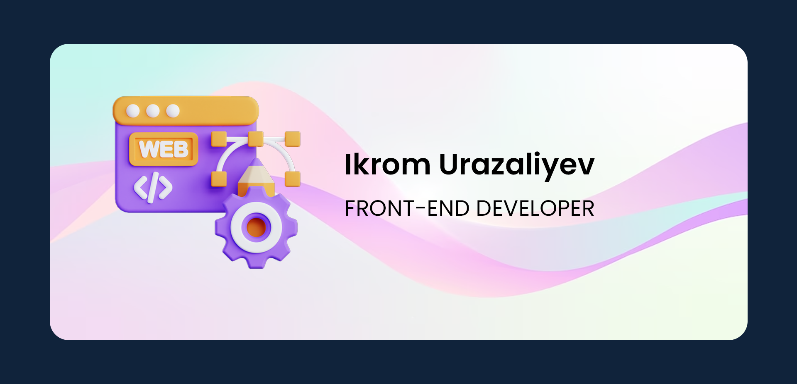

## Hello 👋
<small>
My name is Ikrom Urazaliyev and I am front-end developer from Uzbekistan. I have experience building SPAs and JAMstack sites. I am an avid learner and diligent developer who enjoy working in multidisciplinary teams.
</small>
<!-- == GitHub stats  == -->
<!--  -->
 
 
<!-- == README STATS  == -->

 
 
<!-- == README STATS  == -->

<!-- == SOCAILS IMAGE  == -->
<!-- 

-->

<!-- == VIEWERS  == -->
<!-- 
  
 -->

<!-- == PORTFOLIO  == -->

You can see more: <a href="https://ikrombdm.github.io" target="_blank">ikrombdm</a>

<!-- <h1>hello</h1>
**ikrombdm/ikrombdm** is a ✨ _special_ ✨ repository because its `README.md` (this file) appears on your GitHub profile.

Here are some ideas to get you started:

- 🔭 I’m currently working on ...
- 🌱 I’m currently learning ...
- 👯 I’m looking to collaborate on ...
- 🤔 I’m looking for help with ...
- 💬 Ask me about ...
- 📫 How to reach me: ...
- 😄 Pronouns: ...
- ⚡ Fun fact: ...
-->
